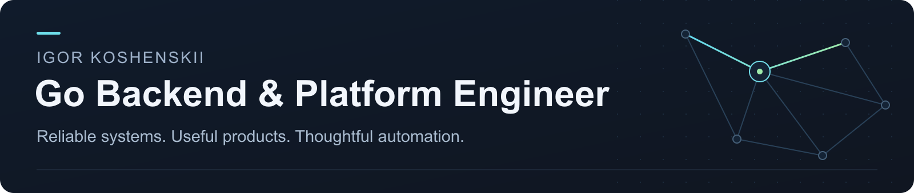

<picture>
  
</picture>

  
  
  

I build **Go services, Kubernetes infrastructure, and AI-powered automation**, taking work from technical design through implementation, testing, and operations. My focus is clear APIs, reliable background workflows, and recovery when dependencies fail.

### Previously at Flant · Deckhouse

Designed and built the core Go backend of **a Kubernetes-native OCI registry in three months**, giving teams an integrated place to store application images without operating a separate registry.

- **Kubernetes-native access:** API extensions, token authentication, and namespace-aware RBAC for users and CI.
- **Reliable storage:** PVC lifecycle and controlled garbage collection, with write recovery after success, timeout, or failure.
- **End-to-end ownership:** architecture, cross-team design reviews, Helm, CI/CD, observability, and operational documentation.

Public work from this period: [authentication](https://github.com/deckhouse/3p-docker_auth/pull/1) · [RBAC](https://github.com/deckhouse/3p-docker_auth/pull/2) · [orchestrator tests](https://github.com/deckhouse/deckhouse/pull/14659) · [registry update reliability](https://github.com/deckhouse/deckhouse/pull/17472).

### Selected open-source contributions

**ITER Organization · IMAS-Validator** 
Removed quadratic path collection: **15.97 s → 83 ms** for 50,000 filled paths in a synthetic benchmark, preserving results and adding regression tests. [Merged PR & benchmark](https://github.com/iterorganization/IMAS-Validator/pull/23).

**whisper.cpp** 
Fixed VAD argument parsing so the minimum-silence option controls the intended parameter. [Merged PR](https://github.com/ggml-org/whisper.cpp/pull/3963).

### Independent work

Under **[Star Sky Project](https://starskyproject.com)**, I build products and the tools needed to run them:

- **Interactive products:** [StarBoard](https://board.starskyproject.com/), a collaborative whiteboard with guest sharing, local storage, and connection recovery; Go/PostgreSQL backends with persistent workflows.
- **Automation & AI tooling:** resumable data pipelines, local speech recognition, multi-source monitoring, and [real-user E2E testing](https://github.com/chupakobra6/telegram-bot-e2e-test-tool).
- **Release engineering:** Go tooling for building, validating, publishing, and maintaining [RimWorld mods and translations](https://github.com/chupakobra6/star-sky-rimworld-mods).

**Core:** Go · PostgreSQL · Kubernetes · Docker · Linux · CI/CD · Prometheus 
**Also:** Python · TypeScript · C# · ASR · AI workflow automation

---

**Moscow, Russia · Open to backend, platform, and developer-tooling opportunities.** 
[Get in touch](mailto:igorpheik@gmail.com) · [Telegram](https://t.me/Pheik15) · [starskyproject.com](https://starskyproject.com)
