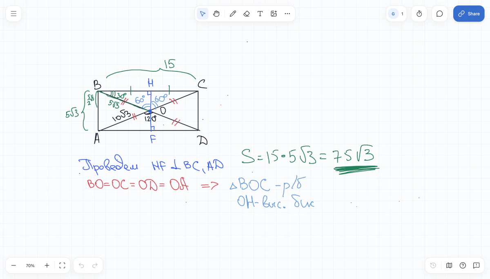

## Go backend & infrastructure

I'm Igor. I worked on Deckhouse at Flant. I also build and run [Star Sky Project](https://starskyproject.com), including StarBoard, an online whiteboard used for lessons.

Moscow · [Email](mailto:igorpheik@gmail.com) · [Telegram](https://t.me/Pheik15) · [Star Sky Project](https://starskyproject.com)

### Flant · Deckhouse

I built the core Go backend for an OCI image registry integrated into Deckhouse in three months. I handled the design, Kubernetes API, authentication and namespace permissions, storage management, and image cleanup through to release.

The cleanup process had to stop writes safely and restore them even after a failed or timed-out job. CI, monitoring and operating docs were part of the work too.

Public contributions: [registry authentication](https://github.com/deckhouse/3p-docker_auth/pull/1), [RBAC](https://github.com/deckhouse/3p-docker_auth/pull/2), [registry update handling](https://github.com/deckhouse/deckhouse/pull/17472).

### StarBoard

An online whiteboard for teaching: draw together, bring in tasks and PDFs, and share a board by link without signing up. I develop the editor, collaboration, cloud storage and deployment.

<a href="https://starskyproject.com/board/">
  <picture>
    <source media="(prefers-color-scheme: dark)" srcset="assets/starboard-dark.png">
    
  </picture>
</a>

[Try StarBoard](https://board.starskyproject.com/) · [About the app](https://starskyproject.com/board/)

I also write Go tools for data collection, bot testing and publishing [RimWorld mods](https://github.com/chupakobra6/star-sky-rimworld-mods).

### ITER · IMAS-Validator

I replaced quadratic path collection with a depth-first traversal. A synthetic benchmark with 50,000 paths went from **15.97 s to 83 ms**. The [merged PR](https://github.com/iterorganization/IMAS-Validator/pull/23) includes the benchmark and regression tests.

---

Go · PostgreSQL · Kubernetes · Python · TypeScript
